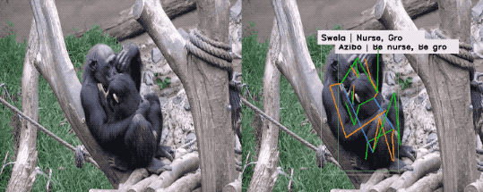

  <h1 align="center">ChimpACT: A Longitudinal Dataset for Understanding Chimpanzee Behaviors   (submitted to NeurIPS 2023 D&B Track)</h1>
  

  

## Introduction

This is the offical [Pytorch](https://pytorch.org/) implementation of our paper:
<h3 align="center">ChimpACT: A Longitudinal Dataset for Understanding Chimpanzee Behaviors   (submitted to NeurIPS 2023 D&B Track)</h3>

<h4 align="center" style="text-decoration: none;">
  <a href="https://shirleymaxx.github.io/", target="_blank">Xiaoxuan Ma</a>*
  ,
  <a href="https://carta.anthropogeny.org/users/stephan-kaufhold", target="_blank">Stephan P. Kaufhold</a>*
  ,
  <a href="https://scholar.google.com/citations?user=DoUvUz4AAAAJ&hl=zh-CN", target="_blank">Jiajun Su</a>*
  ,
  <a href="https://wentao.live/", target="_blank">Wentao Zhu</a>
  ,
  <a href="http://jackterwilliger.com/", target="_blank">Jack Terwilliger</a>
  ,
  <a href="https://www.linkedin.com/in/andy-meza-9bb064213/", target="_blank">Andres Meza</a>
  ,
  <a href="https://yzhu.io/", target="_blank">Yixin Zhu</a>
  ,
  <a href="https://cogsci.ucsd.edu/people/faculty/federico-rossano.html", target="_blank">Federico Rossano</a>
  ,
  <a href="https://cfcs.pku.edu.cn/english/people/faculty/yizhouwang/index.htm", target="_blank">Yizhou Wang</a>
</h4>
<h4 align="center">
  <a href="https://shirleymaxx.github.io/ChimpACT/", target="_blank">[project page]</a> /
  <a href="https://chinapku-my.sharepoint.com/:u:/g/personal/2101111546_pku_edu_cn/Eb5Lg2YpVtlNmUjwoCN3VZMBqOTHXLMg7fyfcGqqe2Rk_g?e=TOzQCd", target="_blank">[dataset example]</a> /
  <a href="https://www.youtube.com/watch?v=KGwDLg8Mn7I", target="_blank">[video]</a>
  <!-- <a href="", target="_blank">[arXiv]</a> /
  <a href="", target="_blank">[paper]</a> /
  <a href="", target="_blank">[supplementary]</a> -->
</h4>

## TODO :white_check_mark:

- [ ] Provide whole dataset when accepted.
- [ ] Provide dataset pre-processing scripts.
- [ ] Provide train & inference code for 3 tracks.
