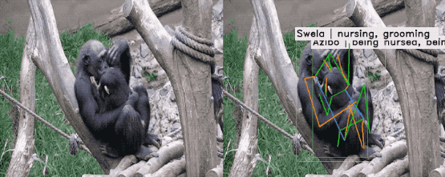

<div align="center">

  <h1 align="center">ChimpACT: A Longitudinal Dataset for Understanding Chimpanzee Behaviors <br> (submitted to NeurIPS 2023 D&B Track)</h1>
  
</div>


<p align="center">
  
</p>

# Introduction

This is the offical [Pytorch](https://pytorch.org/) implementation of our paper:
<h3 align="center">ChimpACT: A Longitudinal Dataset for Understanding Chimpanzee Behaviors <br> (submitted to NeurIPS 2023 D&B Track)</h3>

<h4 align="center" style="text-decoration: none;">
  <a href="https://shirleymaxx.github.io/", target="_blank">Xiaoxuan Ma</a><sup>*</sup>
  ,
  <a href="https://carta.anthropogeny.org/users/stephan-kaufhold", target="_blank">Stephan P. Kaufhold</a><sup>*</sup>
  ,
  <a href="https://scholar.google.com/citations?user=DoUvUz4AAAAJ&hl=zh-CN", target="_blank">Jiajun Su</a><sup>*</sup>
  ,
  <a href="https://wentao.live/", target="_blank">Wentao Zhu</a>
  ,
  <a href="http://jackterwilliger.com/", target="_blank">Jack Terwilliger</a>
  ,
  <a href="https://www.linkedin.com/in/andy-meza-9bb064213/", target="_blank">Andres Meza</a>
  ,
  <a href="https://yzhu.io/", target="_blank">Yixin Zhu</a>
  ,
  <a href="https://cogsci.ucsd.edu/people/faculty/federico-rossano.html", target="_blank">Federico Rossano</a>
  ,
  <a href="https://cfcs.pku.edu.cn/english/people/faculty/yizhouwang/index.htm", target="_blank">Yizhou Wang</a>
</h4>
<h4 align="center">
  <a href="https://shirleymaxx.github.io/ChimpACT/", target="_blank">[project page]</a> /
  <a href="https://drive.google.com/file/d/1QUKYqhB8019y5zn0C2swtmTixrP7prMM/view?usp=sharing", target="_blank">[dataset example]</a> /
  <a href="https://www.youtube.com/watch?v=KGwDLg8Mn7I", target="_blank">[video]</a>
  <!-- <a href="", target="_blank">[arXiv]</a> /
  <a href="", target="_blank">[paper]</a> /
  <a href="", target="_blank">[supplementary]</a> -->
</h4>


# TODO :white_check_mark:

- [x] Provide train & inference code for 3 tracks.
- [x] Provide dataset pre-processing and visualization scripts.
- [ ] Provide whole dataset when accepted.

# Installation

Clone this project. NVIDIA GPUs are needed. 
```bash
git clone https://github.com/ShirleyMaxx/ChimpACT
cd ChimpACT
```

For three benchmarks, we use [MMTracking](https://github.com/open-mmlab/mmtracking), [MMPose](https://github.com/open-mmlab/mmpose), and [MMAction2](https://github.com/open-mmlab/mmaction2), with seperate running environments, respectively. We recommend you to use [Anaconda](https://www.anaconda.com/) virtual environments. Follow below installation instructions for each benchmark task.

### MMTracking Environments

We follow the installation instructions in [MMTracking](https://github.com/open-mmlab/mmtracking/blob/master/docs/en/install.md).
```bash
conda create -n chimp_track python=3.8 -y
conda activate chimp_track

pip install torch==1.8.0+cu111 torchvision==0.9.0+cu111 torchaudio==0.8.0 -f https://download.pytorch.org/whl/torch_stable.html

# install the latest mmcv
# pip install mmcv-full -f https://download.openmmlab.com/mmcv/dist/{cu_version}/{torch_version}/index.html
pip install mmcv-full -f https://download.openmmlab.com/mmcv/dist/cu111/torch1.8.0/index.html

# install mmdetection
pip install mmdet==2.28.2

# install mmtracking
cd mmtracking
pip install -r requirements/build.txt
pip install -v -e .
cd TrackEval
pip install -e .
cd ..

pip install ipdb termcolor imageio imageio[ffmpeg] communities future tensorboard
cd ..
```

### MMPose Environments

We follow the installation instructions in [MMPose](https://github.com/open-mmlab/mmpose/blob/main/docs/en/installation.md).

```bash
conda create --name chimp_pose python=3.8 -y
conda activate chimp_pose
pip install torch==1.8.0+cu111 torchvision==0.9.0+cu111 torchaudio==0.8.0 -f https://download.pytorch.org/whl/torch_stable.html

pip install -U openmim
mim install mmengine
mim install "mmcv>=2.0.0"

cd mmpose
pip install -r requirements.txt
pip install -v -e .
# "-v" means verbose, or more output
# "-e" means installing a project in editable mode,
# thus any local modifications made to the code will take effect without reinstallation.
pip install tensorboard pycocotools seaborn tqdm ipdb imageio openpyxl
pip uninstall -y Pillow
pip install Pillow==9.5.0
cd ..
```

### MMAction2 Environments

We follow the installation instructions in [MMAction2](https://github.com/open-mmlab/mmaction2/blob/main/docs/en/get_started/installation.md).

```bash
conda create --name chimp_action python=3.8 -y
conda activate chimp_action
pip install torch==1.8.0+cu111 torchvision==0.9.0+cu111 torchaudio==0.8.0 -f https://download.pytorch.org/whl/torch_stable.html

pip install -U openmim
mim install mmengine
mim install mmcv
mim install mmdet
mim install mmpose

cd mmaction2
pip install -v -e .
# "-v" means verbose, or more output
# "-e" means installing a project in editable mode,
# thus any local modifications made to the code will take effect without reinstallation.
pip install tensorboard seaborn tqdm ipdb imageio 
pip install imageio[ffmpeg]
cd ..
```

# Data

1. Please check that there is more than 20G storage on your workstation. Download [ChimpACT dataset]() and unzip it to `data/ChimpACT_release/`. The content in `ChimpACT_release` contains the original dataset:
    - `videos_full` includes 163 video clips in `.mp4` format.
    - `labels` includes 163 label `.json` file in COCO-style for each video clip.

2. To run the three tracks, please process the data using the script. Please activate `chimp_track` env. first.

  ```bash
  conda activate chimp_track
  (chimp_track)$ sh scripts/process_data.sh
  ``` 

3. If everything goes well, the data structure should be like this. Folder `ChimpACT_processed` is about 12G. Folder `ChimpACT_release` is about 5G.

  ```text
  ChimpACT
  |-- data
      │-- ChimpACT_processed
          │-- annotations
              │-- action
                  │-- action_list.txt
                  │-- train_action_excluded_timestamps.csv
                  │-- train_action_gt.pkl
                  │-- train_action.csv
                  │-- val_action_excluded_timestamps.csv
                  │-- val_action_gt.pkl
                  │-- val_action.csv
                  │-- test_action_excluded_timestamps.csv
                  │-- test_action_gt.pkl
                  │-- test_action.csv
              |-- train.json
              │-- val.json
              │-- test.json
          │-- reid
              │-- imgs
              │-- meta
          |-- train
              │-- images
              │-- videos
          |-- val
              │-- images
              │-- videos
          |-- test
              │-- images
              │-- videos
      │-- ChimpACT_release
          │-- labels
          │-- videos_full
          │-- action_list.txt
  ├-- mmaction2
  ├-- mmpose
  ├-- mmtracking
  ├-- scripts
  ├-- tools
  ├-- README.md
  ```

4. Make soft links in the three codebases. Change the `${absolute_path}` to the real **ABSOLUTE** path to the `ChimpACT` project.
  ```bash
  ln -s ${absolute_path}/ChimpACT/data mmtracking/
  ln -s ${absolute_path}/ChimpACT/data mmpose/
  ln -s ${absolute_path}/ChimpACT/data mmaction2/
  ```

## Data Statistics & Visualization

We provide code for data statistics in `tools/cal_vis_stat.py`, and for data visualization in `tools/vis_annot.py`. All the running scripts can be found in `scripts/visualize_data.sh`.
 
```bash
conda activate chimp_track
sh scripts/visualize_data.sh
```


# Train & Eval

- Activate corresponding virtual environments and `cd` to `mmtracking`/`mmpose`/`mmaction2` folder to conduct corresponding experiments.
```bash
conda activate chimp_track
cd mmtracking

conda activate chimp_pose
cd mmpose

conda activate chimp_action
cd mmaction2
```
- The running scripts is highly similar. All the `${CONFIG_FILE}` are under `mm*/configs`. To train/evaluate the model,
```python
# train with a GPU
CUDA_VISIBLE_DEVICES=0 python tools/train.py ${CONFIG_FILE} [ARGS]
# train with multiple GPUs
bash tools/dist_train.sh ${CONFIG_FILE} ${GPU_NUM} [PY_ARGS]

# eval with a GPU
CUDA_VISIBLE_DEVICES=0 python tools/test.py ${CONFIG_FILE} ${CHECKPOINT_FILE} [ARGS]
# eval with multiple GPUs
bash tools/dist_test.sh ${CONFIG_FILE} ${CHECKPOINT_FILE} ${GPU_NUM} [PY_ARGS]
```

### Detection, Tracking, and ReID
- The full training & evaluating scripts are in [RUN_Track.md](scripts/RUN_Track.md). 
- We show an example to train & evaluate the [ByteTrack](https://github.com/ifzhang/ByteTrack) model with 4 GPU:
- For more usage, please refer to [MMTracking](https://github.com/open-mmlab/mmtracking).

```python
conda activate chimp_track
cd mmtracking

# train with 4 GPUs
bash tools/dist_train.sh configs/mot/bytetrack/bytetrack_yolox_x_chimp.py 4

# evaluate with 4 GPUs
bash tools/dist_test.sh configs/mot/bytetrack/bytetrack_yolox_x_chimp.py 4 --checkpoint work_dirs/bytetrack_yolox_x_chimp/latest.pth --eval track bbox
```

### Pose Estimation
- The full training & evaluating scripts are in [RUN_Pose.md](scripts/RUN_Pose.md). 
- We show an example to train & evaluate the [CPM](https://github.com/shihenw/convolutional-pose-machines-release) model with 4 GPU:
- For more usage, please refer to [MMPose](https://github.com/open-mmlab/mmpose).

```python
conda activate chimp_pose
cd mmpose

# train with 4 GPUs
bash tools/dist_train.sh configs/chimp_2d_keypoint/topdown_heatmap/coco/td-hm_cpm_8xb64-210e_coco-256x192.py 4 --show-dir vis_pose --interval 1000

# eval with 4 GPUs
bash tools/dist_test.sh configs/chimp_2d_keypoint/topdown_heatmap/coco/td-hm_cpm_8xb64-210e_coco-256x192.py work_dirs/td-hm_cpm_8xb64-210e_coco-256x192/epoch_210.pth 4 --dump results_save/td-hm_cpm.pkl
```

### Spatiotemporal Action Detection
- The full training & evaluating scripts are in [RUN_Action.md](scripts/RUN_Action.md). 
- We show an example to train & evaluate the [SlowFast](https://github.com/facebookresearch/SlowFast) model with 4 GPU:
- For more usage, please refer to [MMAction2](https://github.com/open-mmlab/mmaction2).

```python
conda activate chimp_action
cd mmaction2

# train with 4 GPUs
bash tools/dist_train.sh configs/detection/slowfast/slowfast_kinetics400-pretrained-r50_8xb8-8x8x1-20e_chimp-rgb.py 4

# eval with 4 GPUs
bash tools/dist_test.sh configs/detection/slowfast/slowfast_kinetics400-pretrained-r50_8xb8-8x8x1-20e_chimp-rgb.py work_dirs/slowfast_kinetics400-pretrained-r50_8xb8-8x8x1-20e_chimp-rgb/epoch_20.pth 4
```


# Acknowledgement
This repo is built on the excellent work [MMTracking](https://github.com/open-mmlab/mmtracking), [MMPose](https://github.com/open-mmlab/mmpose), and [MMAction2](https://github.com/open-mmlab/mmaction2). Thanks for these great projects.